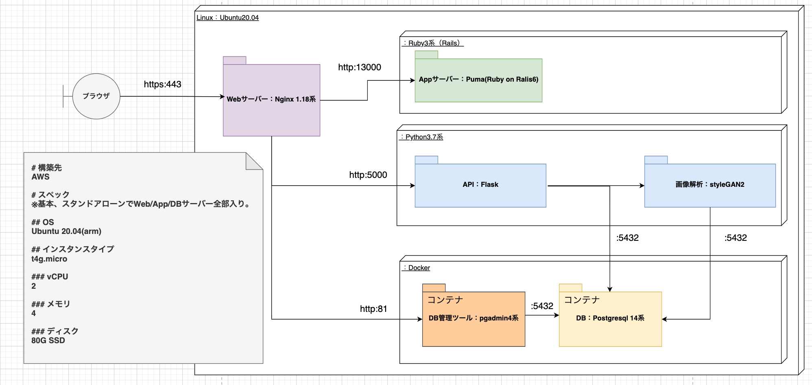

# Dev-face

## 製品概要
### 背景(製品開発のきっかけ、課題等）
* コロナ禍による孤独との戦い。身近なパートナーの存在への渇望。
* テクノロジーにより「たくさん出会える」からこそ、かえって迷い、悩む。
* そんなあなたの好きな顔を見える化し、選択の道標を提供したい。
### 製品説明（具体的な製品の説明）
* 幸せxTechアプリ。出てくる写真を「Yes」「No」でスワイプすると、 自分の好みの顔が表示される。
### 特長

* これまで明確に表現することができなかった「好み」を、見える化し、具体的に示すことが可能に
* スワイプするだけの簡単操作
* 表示される画像は、世の中に存在していない人の画像なので個人情報の問題もクリア
### 解決出来ること
* 孤独解消、ウェルネス改善、少子化
### 今後の展望
* 若者だけでなく　シニア層への適用→人生100年時代へ
* ペット（犬）の顔への応用→より良いマッチングにより動物飼育放棄の低減にも

### 注力したこと（こだわり等）
* とにかく7daysで動くものを作り、一気通貫でデモを実施する
* セキュリティを意識した開発（SSL通信等）

## 開発技術
### 活用した技術
#### データ
* [This Person Does Not Exist（この人は存在しない）](https://thispersondoesnotexist.com/)

#### フレームワーク・ライブラリ・モジュール
##### フロントエンド
* Ruby 2.7.N
* Ruby on Ralis 6
* Hammer.js 
* Popper.js
* Bootstrap
* Jquery
* Webpack

##### バックエンド
* Python 3.7
    * tensorflow==1.14.0
    * numpy==1.16.4
    * matplotlib
    * tqdm
    * pillow
    * psycopg2
* Flask 1.1
* styleGAN2

##### インフラ
* AWS EC2
* Ubuntu 20.04
* Nginx 1.18
* Docker/Docker Dompose 
* Postgresql 12
* pgadmin4

#### 対象デバイス
* スマートフォン
* PC

### 独自技術
#### ハッカソンで開発した独自機能・技術
* 特になし

#### 製品に取り入れた研究内容（データ・ソフトウェアなど）（※アカデミック部門の場合のみ提出必須）
* 特になし

### プロダクト開発 改善点・反省点
#### バックエンド
* 

#### フロントエンド
* 可読性の改善(コメント追記など)
* 不要DBの削除・切り離し
* パッケージ化
